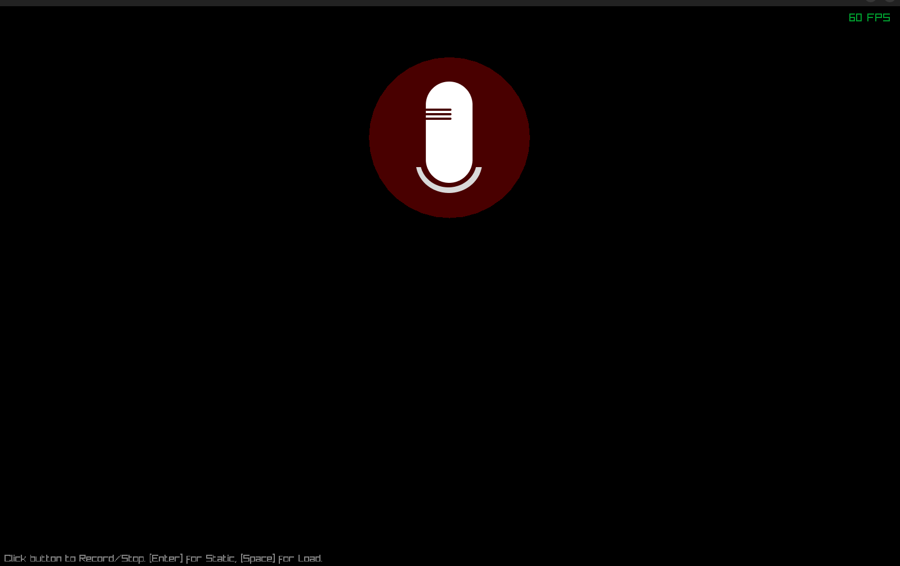
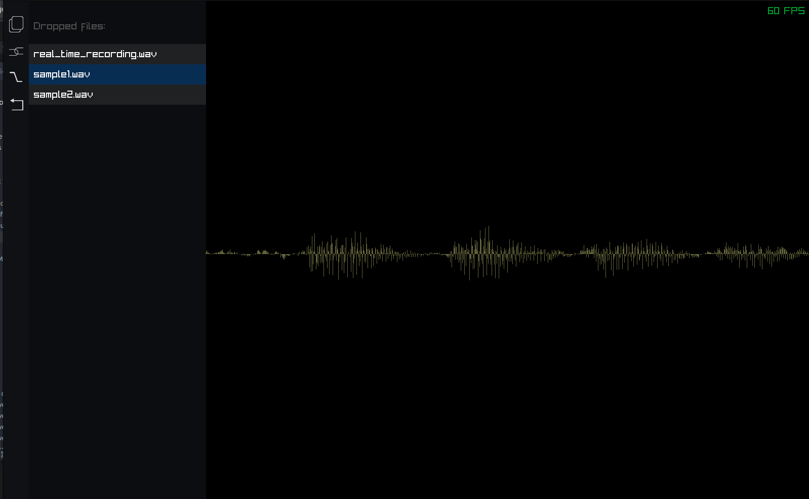
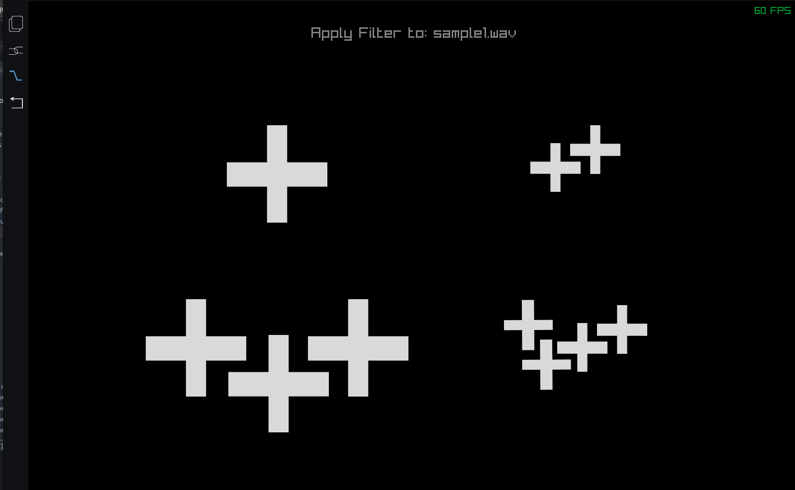

# 🎶 AUDIO_EDITOR

A foundational C project demonstrating audio manipulation, visualization, and recording capabilities using the [raylib](https://www.raylib.com/) library for graphics and UI, and the [miniaudio](https://github.com/mackron/miniaudio) library for audio I/O. This project serves as a starting point for developing simple audio editing tools, sound composers, or audio visualizers.

---

## Table of Contents

* [Overview](#overview)
* [Key Features](#key-features)
* [Dependencies](#dependencies)
* [Prerequisites](#prerequisites)
* [Building the Project](#building-the-project)
* [Usage](#usage)
* [Code Structure](#code-structure)
    * [Data Structures](#data-structures)
    * [Core Functionality](#core-functionality)
* [Contributing](#contributing)
* [License](#license)
* [Acknowledgments](#acknowledgments)

---

## Overview

`AUDIO_EDITOR` provides a basic framework for interacting with WAV audio files. It allows reading audio data, applying simple effects like reversing or filtering, visualizing waveforms, and performing basic audio recording. The integration of raylib enables graphical representation and potential UI interactions, while miniaudio handles cross-platform audio playback and recording tasks efficiently.

---





## Key Features

* **WAV File Handling:**
    * Reads WAV file headers and PCM data according to standard specifications.
    * Includes functionality stub for writing PCM data back to a file (requires further implementation).
* **Audio Manipulation & Effects:**
    * Reverses audio data segments.
    * Applies various low-pass filters:
        * Simple averaging filter.
        * 3rd Order Butterworth filter.
        * 4th Order Butterworth filter.
* **Audio Visualization:**
    * Renders audio waveforms using raylib.
    * Supports zooming functionality for detailed waveform inspection.
* **Real-time Audio:**
    * Basic audio recording capabilities implemented using miniaudio.
* **Data Management:**
    * Utilizes linked lists (`Node`) for managing chunks of audio data.
    * Defines a `Track` structure to represent individual audio tracks.
* **Basic UI Elements:**
    * Includes structures (`DraggableBox`) suitable for creating simple draggable UI components within raylib.

---

## Dependencies

* **[raylib](https://www.raylib.com/):** Required for all graphical output, window management, and UI elements (waveform drawing, interactive elements).
* **[miniaudio](https://github.com/mackron/miniaudio):** Required for cross-platform audio playback and recording functionality. Typically included as a single header file within the project.
* **Standard C Libraries:** `stdio.h`, `stdlib.h`, `string.h`, `stdint.h`, `math.h`.

---

## Prerequisites

Before building the project, ensure you have the following installed on your system:

1.  **C Compiler:** A modern C compiler that supports C99 or later (e.g., GCC, Clang).
2.  **Make:** The `make` build automation tool.
3.  **raylib Library:** The raylib development library. Installation methods vary by operating system (e.g., package manager, compiling from source). Ensure the headers and library files are accessible by the compiler/linker.

---

## Building the Project

This project uses `make` for a streamlined build process.

1.  **Navigate:** Open your terminal or command prompt and change to the directory containing the project's `Makefile` (typically the `src` directory or the project root if the Makefile is configured accordingly).

2.  **Compile:** Run the `make` command:
    ```bash
    make
    ```
    or explicitly:
    ```bash
    make all
    ```
    This command performs the following steps:
    * Compiles the C source files (e.g., `main.c`, `util.c`) into object files. By default, these are often placed in a build directory (e.g., `../build/obj/`).
    * Links the compiled object files with the necessary libraries (raylib, standard math library).
    * Creates the final executable file (e.g., `../build/bin/sound_composer`).

3.  **Clean (Optional):** To remove generated object files and the executable, run:
    ```bash
    make clean
    ```

**Note on Linking:** If you encounter linking errors related to `miniaudio` (unlikely if using the header-only version correctly) or other libraries like `pthread` or `dl` (sometimes required by raylib/miniaudio on Linux), you may need to add appropriate flags (e.g., `-lminiaudio`, `-lpthread`, `-ldl`) to the `LIBS` variable within the `Makefile`.

---

## Usage

After successfully building the project:

1.  **Run via Make:** While in the directory containing the `Makefile`, you can often run the project using:
    ```bash
    make run
    ```
    This command typically depends on the `all` target (ensuring the project is built) and then executes the compiled program.

2.  **Run Directly:** Alternatively, navigate to the directory containing the executable (e.g., `../build/bin/`) or run it using its relative path from the `Makefile` directory:
    ```bash
    ../build/bin/sound_composer
    ```

Executing the program will launch the application window, where you can interact with its features (loading files, viewing waveforms, etc., depending on the current implementation state).

---

## Code Structure

### Data Structures

* **`WAVHeader`**: Stores metadata parsed from a WAV file's header section.
* **`Node`**: Represents a node in a linked list, designed to hold a chunk of PCM audio data (`int16_t *pcm`).
* **`Track`**: Encapsulates an audio track, potentially using a linked list (`Node *head`) or a single contiguous buffer (`int16_t *pcm`) for its audio data.
* **`DraggableBox`**: A utility structure for managing interactive, draggable rectangular areas within the raylib window.
* **`Screen` (enum)**: Defines distinct states or views within the application (e.g., `Load`, `Real`, `Static`).

### Core Functionality

The codebase is broadly organized into the following areas:

* **File I/O (`util.c` / `main.c`):** Functions for reading WAV headers (`read_wav_header`) and PCM data (`read_pcm_data`), and writing PCM data (`write_pcm_data`).
* **Data Structure Management (`util.c` / `main.c`):** Functions for managing the linked list of audio data (`insert`, `free_list`).
* **Audio Processing (`util.c`):** Implementation of audio effects like `reverse`, `low_filter`, and various Butterworth filters.
* **Visualization (`main.c`):** Functions utilizing raylib to draw waveforms (`draw_waveform`) and handle interactions like zooming (`zoom`).
* **Audio Recording (`main.c`):** Functions interfacing with miniaudio to manage recording (`StartAudioRecording`, `StopAudioRecording`) and handle the audio data stream (`data_callback`).
* **Main Application Logic (`main.c`):** Contains the main loop, event handling, state management (`Screen`), and coordinates calls to other modules.

*(Refer to comments within the source code files for detailed explanations of specific functions.)*

---

## Contributing

Contributions are welcome! If you find bugs, have suggestions for improvements, or want to add new features, please feel free to:

1.  Open an issue on the project's repository  to discuss the change.
2.  Fork the repository, make your changes, and submit a pull request.


---

## License

---

## Acknowledgments

* This project relies heavily on the fantastic [raylib](https://www.raylib.com/) library by Ramon Santamaria ([@raysan5](https://github.com/raysan5)) and contributors.
* Audio recording and playback capabilities are provided by the excellent [miniaudio](https://github.com/mackron/miniaudio) library by David Reid ([@mackron](https://github.com/mackron)) and contributors.


---